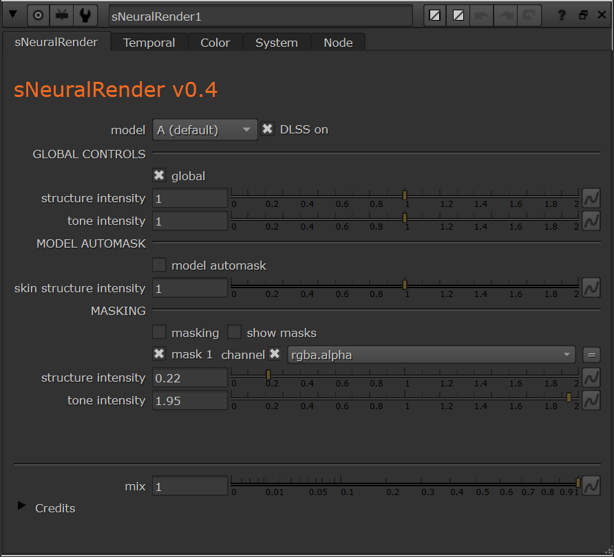

<h1 align="center">sNeuralRender</h1>

<p align="center"><b>NVIDIA DLSS 5 Neural Rendering as a native Nuke node.</b><br>
Neural relighting and detail on your footage, right in the node graph — with your own masks,
per-mask strengths and temporal history.</p>

<p align="center">
  <a href="https://github.com/AlesUshakou/sNeuralRender/releases/latest"></a>
  
  
  
  <a href="LICENSE"></a>
</p>

<p align="center"></p>

<p align="center">
  <a href="https://github.com/AlesUshakou/sNeuralRender/releases/latest"><b>⬇ Download the latest release</b></a>
  &nbsp;·&nbsp; <a href="#install">Install</a>
  &nbsp;·&nbsp; <a href="#using-the-node">Using the node</a>
  &nbsp;·&nbsp; <a href="#troubleshooting">Troubleshooting</a>
</p>

A native Nuke plugin that runs NVIDIA's **DLSS 5 Neural Rendering** (NGX feature 18) on your
footage: global structure/tone controls, the runtime's automask, any number of your own masks
with their own strengths, and temporal history driven by NVIDIA Optical Flow or your own
motion vectors. `sNeuralRender-vX.Y-win64.zip` covers Nuke 16.1 and 17.0 on Windows x64.

> Not affiliated with or endorsed by NVIDIA. The plugin only drives NVIDIA's runtime; the
> runtime itself is NVIDIA software and is **not included** in this download (see below).

## Requirements

| | |
|---|---|
| OS | Windows 10 / 11, x64 |
| Nuke | 16.1 or 17.0 (Windows builds included; NukeX / Studio work the same) |
| GPU | NVIDIA GPU supported by DLSS 5 Neural Rendering (GeForce RTX 40 / 50 series; tested on RTX PRO 6000 Blackwell) |
| Driver | A driver whose NGX core supports feature 18. Tested with 610.88. Older drivers report `feature 18 not available`. |
| Runtime | **`nvngx_dlssnr.dll`, not included** — NVIDIA's Neural Rendering runtime, tested build 310.8.0. See [Install](#install) for where to get it and where to put it. |

## Install

### ⚠️ You need one file that is not in this download: `nvngx_dlssnr.dll`

`nvngx_dlssnr.dll` is NVIDIA's Neural Rendering runtime (the neural network itself). It is
NVIDIA software, so it is **not redistributed** with this plugin, and **the node does nothing
without it** (`runtime info` on the System tab says `runtime not found`).

Where to get it:

- It ships inside NVIDIA's DLSS 5 packages and inside applications that bundle the DLSS 5
  Neural Rendering runtime. The build this plugin was developed and tested with is
  **310.8.0**. Two packages that carry exactly that build:
  - [DLSS 5 AIO](https://github.com/ShugokiFable/dlss5-aio) — a bundle of official NVIDIA DLSS
    DLLs plus the Neural Rendering runtime; take `nvngx_dlssnr.dll` (v310.8.0) from it.
  - [DLSS 5 video player](https://github.com/2600th/dlss5-video-player) — the release zip
    contains `neural-runtime\nvngx_dlssnr.dll`.
- Use a legally obtained copy and keep NVIDIA's terms. Other builds of the runtime may behave
  differently (parameters, supported inputs, quality).

Where to put it — exactly here, file name unchanged:

```
sNeuralRender\runtime\nvngx_dlssnr.dll
```

(or point `runtime dir` on the node's System tab at any folder that contains it).

The two other NVIDIA parts, the NGX core `_nvngx.dll` and NVIDIA Optical Flow `nvofapi64.dll`,
come with your display driver; there is nothing to copy for them.

### Steps

1. Download `sNeuralRender-vX.Y-win64.zip` from the
   [latest release](https://github.com/AlesUshakou/sNeuralRender/releases/latest) (not GitHub's
   "Source code" archive, it holds only this README) and unzip it. You get one folder,
   `sNeuralRender`, with this layout:

   ```
   sNeuralRender\
     init.py            adds the build matching your Nuke version to the plugin path
     16.1\              sNeuralRender.dll for Nuke 16.1
     17.0\              sNeuralRender.dll for Nuke 17.0
     core\              dlss5nr_core.dll, nvngx.dll_snr.dll (plugin code, Nuke-independent)
     runtime\           <-- put nvngx_dlssnr.dll here (see above)
   ```

2. Copy **`nvngx_dlssnr.dll`** into **`sNeuralRender\runtime\`**.

3. Put the `sNeuralRender` folder somewhere on your Nuke plugin path, usually
   `C:\Users\<you>\.nuke\`, and add to `C:\Users\<you>\.nuke\init.py` (create the file if
   it does not exist):

   ```python
   nuke.pluginAddPath('./sNeuralRender')
   ```

   Optional menu entry, in `menu.py` next to it:

   ```python
   nuke.menu('Nodes').addCommand('Filter/sNeuralRender', "nuke.createNode('sNeuralRender')")
   ```

4. Restart Nuke. Press Tab in the node graph and type `sNeuralRender`.

5. Open the node's **System** tab: `runtime info` shows the GPU, the NGX core that was found,
   the runtime path (`...\sNeuralRender\runtime`) and whether NVIDIA Optical Flow is available.
   `runtime not found` means step 2 was skipped. Everything the plugin and the runtime log goes
   to `sNeuralRender\<version>\sNeuralRender.log`.

Studio / pipeline install: any directory on `NUKE_PATH` works the same way; only the
`nuke.pluginAddPath('./sNeuralRender')` line is needed, the folder's own `init.py` picks the
Nuke version. If a build for your Nuke version is missing, the Nuke console says
`sNeuralRender: no build for Nuke X.Y`.

## Using the node

Inputs: `src` (the image; `rgb` is processed, alpha and other channels pass through),
`motion` (optional Nuke `backward` motion vectors), `mask1`, `mask2`, … (appear as you connect
masks). Output: `rgba` plus `nr_motion.u/v`, the vectors the runtime actually used (pixels).

The panel follows NVIDIA's own "DLSS 5 developer controls":

- **model** A / B / C — the runtime's three styles. **DLSS on** bypasses the node.
- **GLOBAL CONTROLS** — `global` runs the neural renderer on the whole frame with
  `structure intensity` / `tone intensity`. Switch `global` off to touch only the masked areas.
- **MODEL AUTOMASK** — the runtime's automatic character/skin mask with its own
  `skin structure intensity` (it only has an effect while automask is on).
- **MASKING** — connect a mask to `mask1` and its controls appear (the next arrow, `mask2`,
  shows up automatically). Every mask is a separate neural pass with its own structure and
  tone, composited over the result (`show masks` displays them in colour). Each pass costs one
  runtime evaluation.
- **mix** — final blend with the source.

**Temporal** tab: `temporal` (on by default) keeps the runtime's history across frames, which is
what removes frame-to-frame flicker. Playing or rendering forward continues the history;
jumping to a frame replays up to `history` frames before it (from the last detected cut).
`reset on cut` / `cut threshold` detect cuts automatically. Motion comes from **NVIDIA Optical
Flow** (default), from the `motion` input (SmartVector / VectorGenerator `backward` layer), or is
zero. Finished frames are cached (`cache (MB)`).

**Color** tab: the runtime is display-referred SDR (sRGB). With `input colorspace = linear`
(default) the node encodes to sRGB before the runtime and decodes after; values outside 0..1
are clamped. Use `display` when your footage is already video-encoded.

## Performance

RTX PRO 6000, one pass: ≈15 ms per 1080p frame, ≈33 ms per 4K frame, plus one-time
initialisation (≈0.4 s) and ≈0.25 s per session (per pass / resolution). Each mask adds a pass.

## Known limitations

- SDR only: the runtime expects display-referred sRGB and clamps to 0..1.
- Runtime 310.8.0 ignores its depth input and has one weight set; the node therefore exposes
  neither depth nor presets (they will come back when a runtime uses them).
- Windows only, Nuke 16.1 and 17.0 (other versions need a rebuild from source).
- Temporal results depend on the frame order: a Write that starts mid-shot replays `history`
  frames first, and Nuke's own caching does not know about frames before the current one.

## Troubleshooting

| Message / symptom | Meaning |
|---|---|
| `Unknown command sNeuralRender` | The folder is not on the plugin path, or no build for this Nuke version (see the console). |
| `runtime not found` in `runtime info` | `nvngx_dlssnr.dll` is not in `sNeuralRender\runtime\` (see Install), or `runtime dir` on the System tab points elsewhere. |
| `feature 18 not available` / NGX errors | Driver too old or GPU not supported. |
| Flicker between frames | Turn `temporal` on (Temporal tab). |
| Slow scrubbing with heavy upstream nodes | Each random access replays `history` frames; lower `history`, or precomp the input. |

## Credits

- NVIDIA DLSS 5 Neural Rendering and NVIDIA Optical Flow — NVIDIA Corporation.
- Runtime integration research: [lisitskyaa/ComfyUI-DLSS5-NR](https://github.com/lisitskyaa/ComfyUI-DLSS5-NR)
  and [2600th/dlss5-video-player](https://github.com/2600th/dlss5-video-player).
- Plugin: Aleš Ushakou, 2026 — [LinkedIn](https://www.linkedin.com/in/ale%C5%A1-ushakou-84250814) · [GitHub](https://github.com/AlesUshakou)

## License

The plugin is MIT licensed (see `LICENSE`). NVIDIA components are NVIDIA software under
NVIDIA's terms and are not part of this download. DLSS is a trademark of NVIDIA Corporation.
